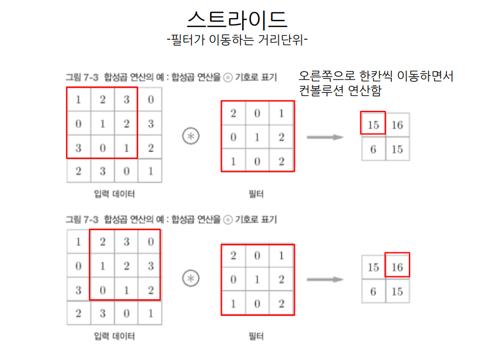

# CNN
## 완전연견 계층의 문제점
- __이미지 데이터를 처리할 때 이미지의 형상이 무너진다__
>
>가로 세로 채널을 입력으로 넣을 때 1차원으로 펴서 넣기때문에 이미지상의 중요한 공간정 정보가 소실된다
>

- __CNN은 입력데이터도 3차원으로 넣고, 다음 층으로 전달할때도 3차원으로 전달하기때문에 공간의 정보가 남아있다__

 
 
 

 
 
 

 
 
 

 
 
 

 
 
 

 
 
 

 
 
 

 
 
 

 
 
 

 
 
 

