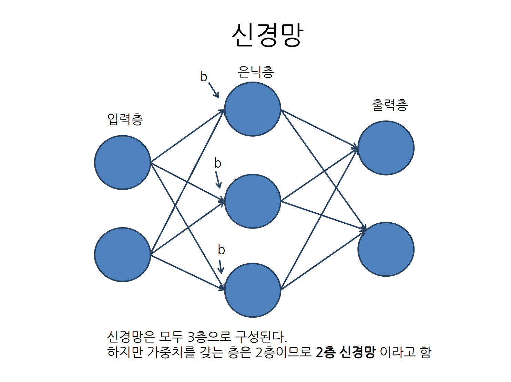
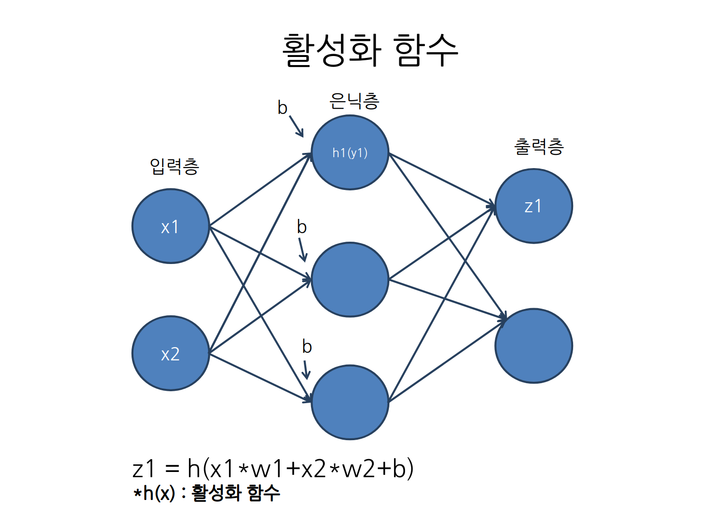
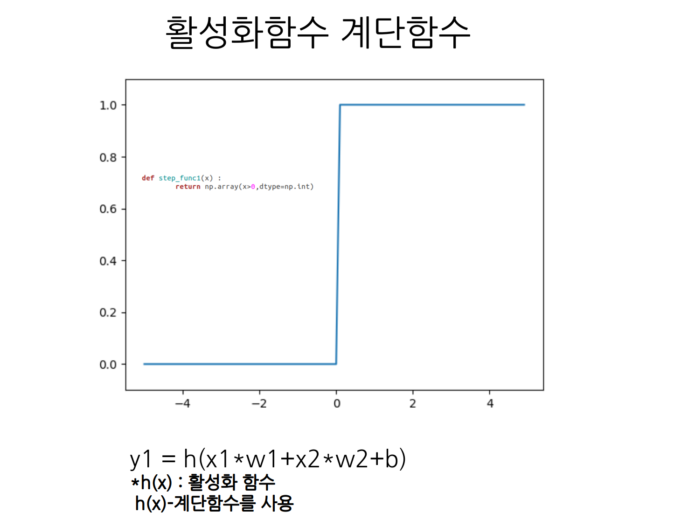
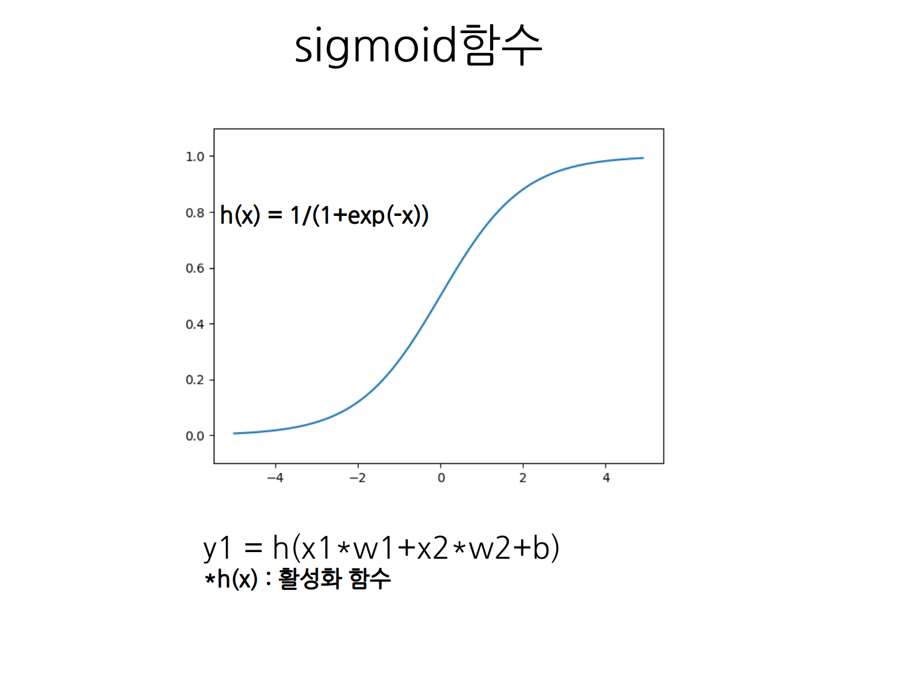
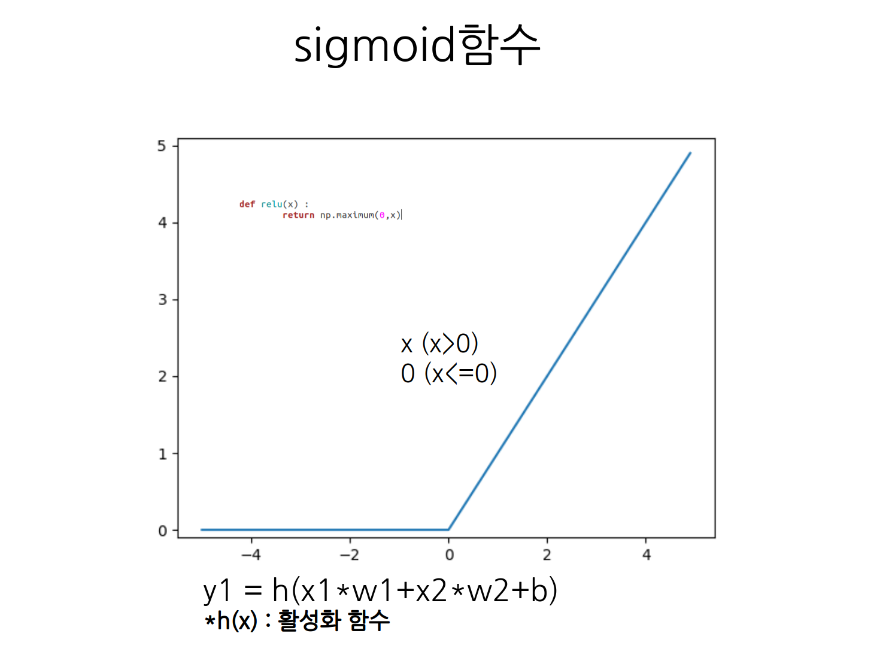
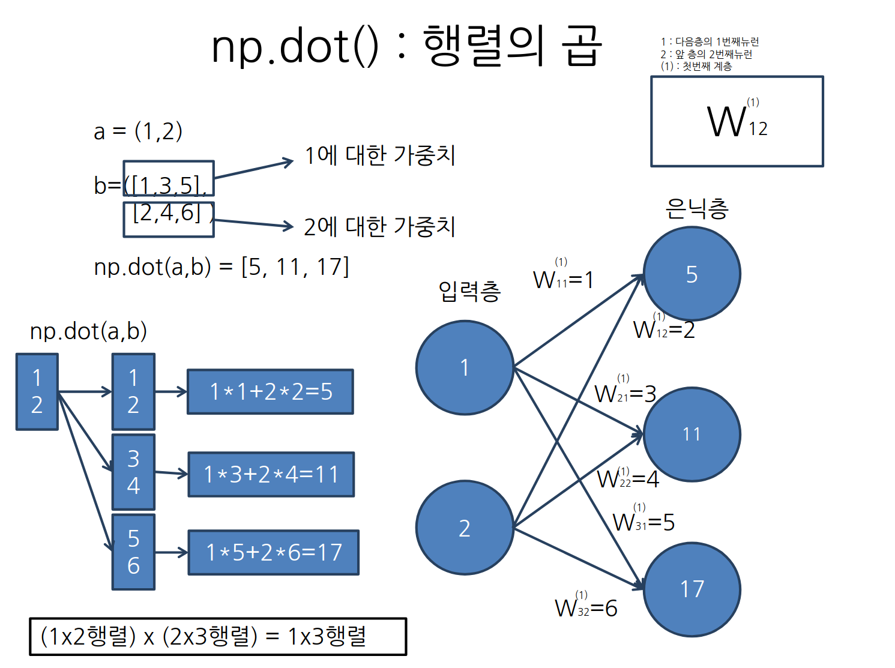
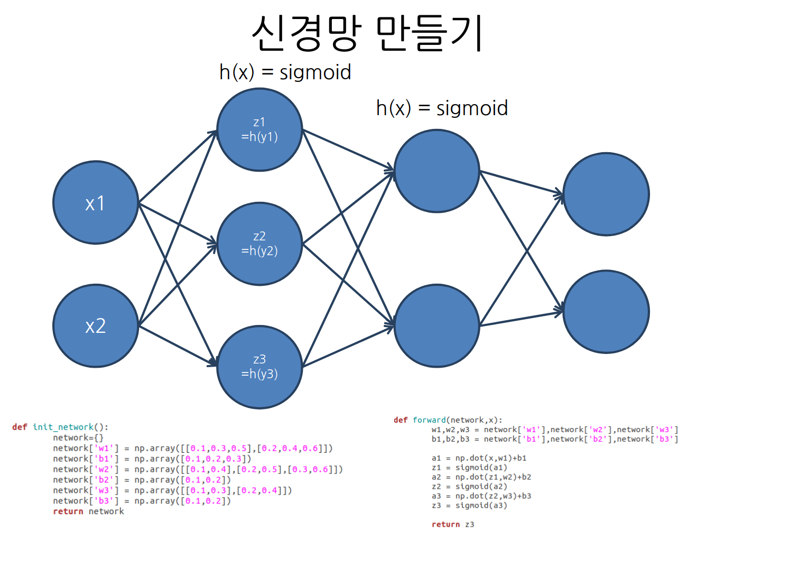
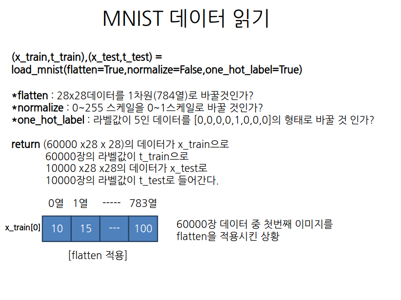

## 신경망 만들기

 
 
 
 

>
> 
>  활성화함수는 y=cx와 같은 선형함수로 해서는 안된다. 선형함수로 하게되면 활성화함수를 쓰는 효과거 거의없기때문에 비선형함수를 이용해서 이전 층의 출력값을 한번 비틀어줘야한다.
 
 
 
 

 
 
 
 

 
 
 
 

 
 
 
 

 
 
 
 

 
 
 

## 신경망으로 MNIST 분류

